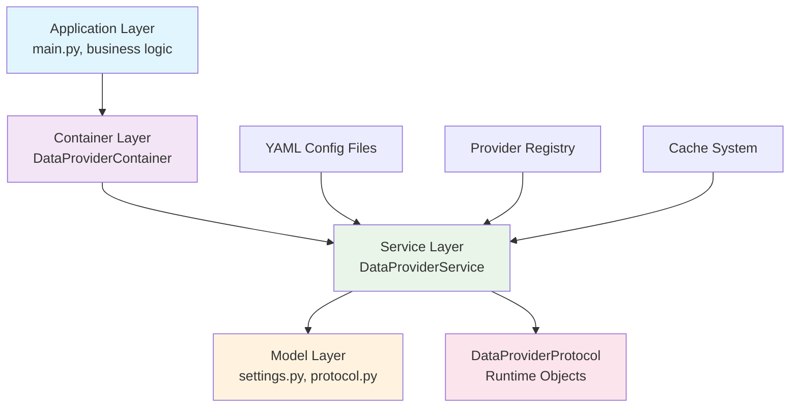

# Data Providers Module

## Overview

The Data Providers module provides a flexible system for loading and managing different data sources (CSV, Yahoo, etc.) through a unified interface. It follows a clean architecture pattern with dependency injection and protocol-based design.

## Architecture



### Layer Responsibilities

- **Application Layer**: Uses container for provider access, business logic
- **Container Layer**: DI & Wiring, dependency management
- **Service Layer**: Business logic, YAML loading, provider resolution
- **Model Layer**: Data models, parsing, validation

## Core Components

### 1. DataProviderService (Service Layer)

**Purpose**: Business logic for provider orchestration and configuration loading.

**Key Features**:
- Loads YAML configuration files
- Manages provider registry and caching
- Resolves provider configurations

**Methods**:
- `get(name: str) -> DataProviderProtocol`: Get provider by name
- `get_all() -> List[DataProviderProtocol]`: Get all providers
- `clear_cache() -> None`: Clear provider cache

### 2. DataProviderProtocol (Runtime Interface)

**Purpose**: Unified interface for all data providers.

**Key Features**:
- Standardized data access methods
- Symbol and timeframe validation
- Price data retrieval

### 3. DataProviderContainer (DI Container)

**Purpose**: Dependency injection configuration and wiring.

**Key Features**:
- Configures service dependencies
- Manages cache and observer setup
- Provides factory methods

## Configuration Flow

### 1. Settings Configuration

```json
// configs/settings.json
{
  "data_provider": {
    "config_dir": "configs/providers/data",
    "providers": {
      "csv": {
        "raw_config": "core.data_provider.providers.csv.RawCSVPriceFeedConfig",
        "target_config": "core.data_provider.providers.csv.CSVPriceFeedConfig",
        "provider_class": "core.data_provider.providers.csv.CSVPriceFeedProvider"
      }
    }
  }
}
```

### 2. Provider Configuration

```yaml
# configs/providers/data/csv.yaml
name: csv
data_dir: tests/data
file_pattern: "*.csv"
date_format: "%Y-%m-%d %H:%M:%S"
timeframes:
  supported_timeframes:
    - "1m"
    - "5m"
    - "15m"
  native_timeframe: "1m"
  resample_strategy:
    open: "first"
    high: "max"
    low: "min"
    close: "last"
    volume: "sum"
```

### 3. Resolution Process

1. **Load Settings**: Parse settings.json for provider registry
2. **Load YAML**: Parse provider YAML file into raw dictionary
3. **Parse Raw**: Convert to raw config model with validation
4. **Resolve Config**: Build target config with resolved objects
5. **Create Provider**: Instantiate provider with config

## Usage Examples

### Basic Usage

```python
# Using service directly
service = DataProviderService(
    config_dir=Path("configs/providers/data"),
    cache=cache,
    registry=provider_registry
)

provider = service.get("csv")
print(f"Provider: {provider.name}")
print(f"Symbols: {provider.symbols}")
print(f"Timeframes: {provider.timeframes}")
```

### Container Usage

```python
# Using dependency injection
@inject
def get_price_data(
    provider_service: DataProviderService = Provide[DataProviderContainer.service]
):
    provider = provider_service.get("csv")
    data = provider.get_price_data("AAPL", "5m")
    return data
```

## File Structure

```
src/core/data_provider/
├── __init__.py
├── settings.py         # Settings models, provider registry
├── service.py          # DataProviderService
├── protocol.py         # DataProviderProtocol
├── container.py        # DI container configuration
└── providers/
    ├── __init__.py
    └── csv.py          # CSV provider implementation

tests/core/data_provider/
├── __init__.py
├── test_data_provider_service.py
├── test_data_provider_container.py
├── test_data_provider_settings.py
└── test_csv_provider.py
```

## TODO

- [ ] **Additional Providers**: Yahoo, Alpha Vantage, etc.
- [ ] **Real-time Data**: WebSocket support
- [ ] **Data Validation**: Schema validation for price data

**Quick Fixes Needed:**
1. Move `configs/providers/csv.yaml` to `configs/providers/data/csv.yaml`
2. Ensure test data files follow the SYMBOL_xxxx naming convention (e.g., `AAPL_sample.csv` instead of `CL_5min_sample.csv`)
