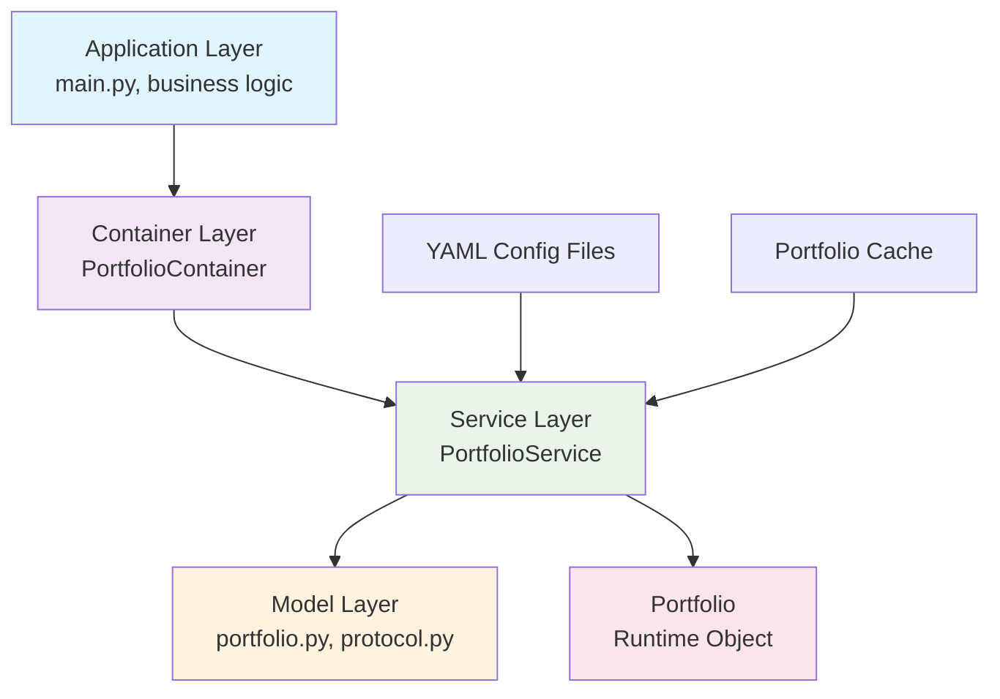

# Portfolio Module

## Overview

The Portfolio module provides a complete portfolio management system for tracking capital, positions, and P&L across trading sessions. It follows a clean architecture pattern with dependency injection and protocol-based design.

## Architecture



### Layer Responsibilities

- **Application Layer**: Uses container for portfolio access, business logic
- **Container Layer**: DI & Wiring, dependency management
- **Service Layer**: Business logic, YAML loading, caching
- **Model Layer**: Data models, validation, protocols

## Core Components

### 1. PortfolioService (PortfolioServiceProtocol) (Service Layer)

**Purpose**: Business logic for portfolio management and operations.

**Key Features**:
- Loads portfolio configuration from YAML files
- Manages portfolio caching for performance
- Handles portfolio operations (equity, positions, P&L)
- Implements `PortfolioServiceProtocol`

**Methods**:
- `get(name: str) -> PortfolioProtocol`: Get portfolio by name
- `get_all() -> List[PortfolioProtocol]`: Get all portfolios

### 2. Portfolio (PortfolioProtocol) (Runtime Object)

**Purpose**: Runtime portfolio with state and trading operations.

**Key Features**:
- Implements `PortfolioProtocol`
- Manages portfolio state (capital, positions, P&L)
- Provides trading operations and risk management
- Tracks session relationships

**Properties**:
- `name`: Portfolio name
- `initial_capital`: Starting capital
- `current_equity`: Current portfolio value

**Methods**:
- `get_current_equity() -> Decimal`: Get current equity
- `can_open_position(symbol, quantity, price) -> bool`: Check if position can be opened
- `get_realised_pnl() -> Decimal`: Get realised P&L
- `get_unrealised_pnl() -> Decimal`: Get unrealised P&L
- `get_open_sessions() -> List[TradingSessionProtocol]`: Get active sessions

### 3. PortfolioContainer (DI Container)

**Purpose**: Dependency injection configuration and wiring.

**Key Features**:
- Configures service dependencies
- Provides factory methods
- Manages portfolio caching

**Configuration**:
```python
class PortfolioContainer(containers.DeclarativeContainer):
    config = providers.Configuration()
    settings = providers.Dependency(instance_of=PortfolioSettings)
    portfolio_cache = providers.Singleton(dict)

    service = providers.Factory(
        PortfolioService,
        settings=settings,
        cache=portfolio_cache,
    )
```

## Configuration Flow

### 1. YAML Configuration

```yaml
# configs/portfolios/main_account.yaml
name: "Main Trading Account"
description: "Primary trading account for day trading"
initial_capital: 100000.00
risk_limits:
  max_position_size: 10000.00
  max_drawdown: 0.10
  stop_loss_pct: 0.02
  take_profit_pct: 0.04
```

### 2. Configuration Models

**PortfolioConfig**: Raw YAML data with validation
**Portfolio**: Runtime object with business logic

### 3. Resolution Process

1. **Load YAML**: Parse YAML file into raw dictionary
2. **Validate Config**: Convert to `PortfolioConfig` with validation
3. **Create Portfolio**: Build `Portfolio` with business logic
4. **Cache Portfolio**: Store for future access

## Usage Examples

### Basic Usage

```python
# Using service directly
service = PortfolioService(
    settings=PortfolioSettings(config_dir=Path("configs/portfolios")),
    cache={}
)

portfolio = service.get("main_account")
print(f"Portfolio: {portfolio.name}")
print(f"Initial Capital: ${portfolio.initial_capital}")
print(f"Current Equity: ${portfolio.get_current_equity()}")
```

### Container Usage

```python
# Using dependency injection
@inject
def run_trading_system(
    portfolio_service: PortfolioServiceProtocol = Provide[PortfolioContainer.service]
):
    portfolio = portfolio_service.get("main_account")
    
    # Check if we can open a position
    if portfolio.can_open_position("AAPL", Decimal("100"), Decimal("150.00")):
        # Execute trade
        pass
```

### Testing

```python
# Test service with mocked dependencies
def test_portfolio_service_happy_path(mock_portfolio_config):
    service = PortfolioService(
        settings=PortfolioSettings(config_dir=Path("/tmp/portfolios")),
        cache={}
    )

    portfolio = service.get("test_portfolio")
    assert isinstance(portfolio, Portfolio)
    assert portfolio.name == "Test Portfolio"
    assert portfolio.initial_capital == Decimal("10000.00")
```

## File Structure

```
src/core/portfolio/
├── __init__.py
├── portfolio.py        # Service, runtime portfolio, config models
├── protocol.py         # Protocol definitions
└── container.py        # DI container configuration

tests/core/portfolio/
├── __init__.py
├── test_portfolio.py           # Tests portfolio.py (models & business logic)
├── test_portfolio_service.py   # Tests PortfolioService
├── test_portfolio_container.py # Tests container.py (DI setup)
└── conftest.py                 # Shared test fixtures
```

## Key Benefits

1. **Separation of Concerns**: Clear boundaries between layers
2. **Dependency Injection**: Loose coupling and testability
3. **Protocol-Based**: Interface contracts for flexibility
4. **Caching**: Performance optimization for portfolio loading
5. **Configuration-Driven**: YAML-based portfolio definition
6. **Type Safety**: Full type hints and validation
7. **Testability**: Easy mocking and unit testing
8. **Risk Management**: Built-in risk limits and position sizing

## Future Enhancements

- [ ] **Multi-Currency Support**: Handle different currencies
- [ ] **Position Tracking**: Detailed position management
- [ ] **Performance Analytics**: Portfolio performance metrics
- [ ] **Risk Monitoring**: Real-time risk alerts
- [ ] **Session Integration**: Better integration with trading sessions 