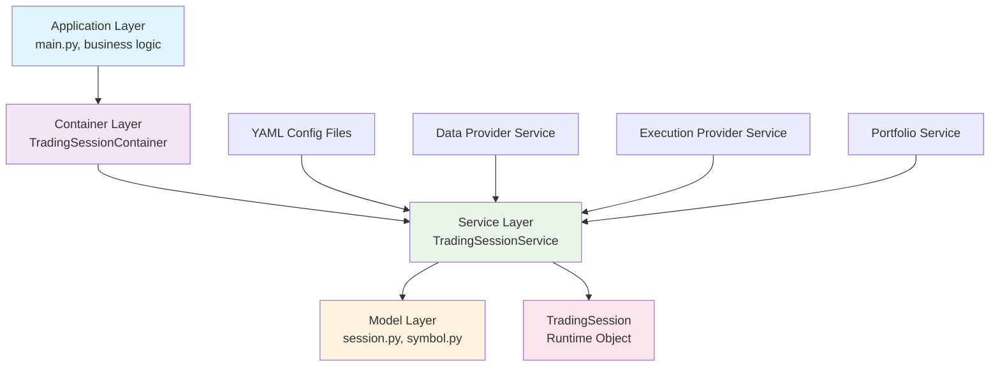

# Trading Sessions Module

## Overview

The Trading Sessions module provides a complete orchestration system for managing trading sessions from YAML configuration files to fully resolved runtime objects. It follows a clean architecture pattern with dependency injection and protocol-based design.

## Architecture



### Layer Responsibilities

- **Application Layer**: Uses container for session access, business logic
- **Container Layer**: DI & Wiring, dependency management
- **Service Layer**: Business logic, YAML loading, dependency resolution
- **Model Layer**: Data models, parsing, validation

## Core Components

### 1. TradingSessionService (TradingSessionServiceProtocol) (Service Layer)

**Purpose**: Business logic for session orchestration and dependency resolution.

**Key Features**:
- Loads YAML configuration files 
- Resolved nested dependencies like Providers, Portfolio, Strategies
- While it can be directly instantiated, it is done by `TradingSessionContainer`

**Methods**:
- `get(name: str) -> TradingSessionProtocol`: Get session by name
- `get_all() -> List[TradingSessionProtocol]`: Get all sessions

### 2. TradingSession(TradingSessionProtocol) (Runtime Object)

**Purpose**: Runtime session with state and trading operations.

**Key Features**:
- Implements a number of business logic specific methods


### 3. TradingSessionContainer (DI Container)

**Purpose**: Dependency injection configuration and wiring.

**Key Features**:
- Configures service dependencies
- Provides factory methods
- Manages provider resolution


## Configuration Flow

### 1. YAML Configuration

```yaml
# configs/sessions/day_trading.yaml
name: "Day Trading Session"
description: "High-frequency trading session for intraday strategies"
portfolio: "main_account"
capital_allocation: 30000.00
symbols:
  AAPL:
    providers:
      data: "csv"
      execution: "ib"
    timeframe: "5m"
    enabled: true
  SPY:
    providers:
      data: "yahoo"
      execution: "alpaca"
    timeframe: "1m"
    enabled: true
```

### 2. Configuration Models

**RawSessionConfig**: Raw YAML data with string references of the yaml
**TradingSessionConfig**: Fully resolved configuration with actual objects like Provider classes

### 3. Resolution Process

1. **Load YAML**: Parse YAML file into raw dictionary
2. **Parse Raw**: Convert to `RawSessionConfig` with validation
3. **Resolve Dependencies**: 
   - Resolve portfolio by name
   - Resolve data providers by name
   - Resolve execution providers by name
4. **Create Config**: Build `TradingSessionConfig` with resolved objects
5. **Create Session**: Instantiate `TradingSession` with config

## Usage Examples

### Basic Usage

```python
# Using service directly
service = TradingSessionService(
    sessions_dir=Path("configs/sessions"),
    data_provider_service=data_service,
    execution_provider_service=execution_service,
    portfolio_service=portfolio_service
)

session = service.get("day_trading")
print(f"Session: {session.name}")
print(f"Portfolio: {session.portfolio_name.name}")
print(f"Symbols: {session.get_enabled_symbols()}")
```

### Container Usage

```python
# Using dependency injection
@inject
def run_trading_system(
    session_service: TradingSessionServiceProtocol = Provide[TradingSessionContainer.service]
):
    session = session_service.get("day_trading")
    price_data = session.get_price_data("AAPL")
    # ... trading logic
```

### Testing

## File Structure

```
src/core/sessions/
├── __init__.py
├── session.py          # Service, runtime session, config models
├── symbol.py           # Symbol configuration models
├── protocols.py        # Protocol definitions
└── container.py        # DI container configuration

tests/core/sessions/
├── __init__.py
├── test_trading_session.py           # Tests session.py (models & parsing)
├── test_trading_session_service.py   # Tests TradingSessionService from session.py
├── test_trading_session_container.py # Tests container.py (DI setup)
├── test_sesssions_symbol_config.py   # Tests symbol.py (symbol models)
└── conftest.py                       # Shared test fixtures
```


## TODO

- [ ] **Strategy Integration**: Add strategy loading and execution
- [ ] **Dynamic Configuration**: Hot-reload configuration changes  
